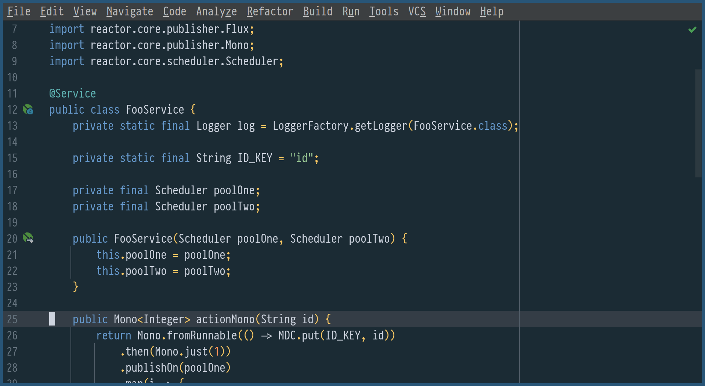
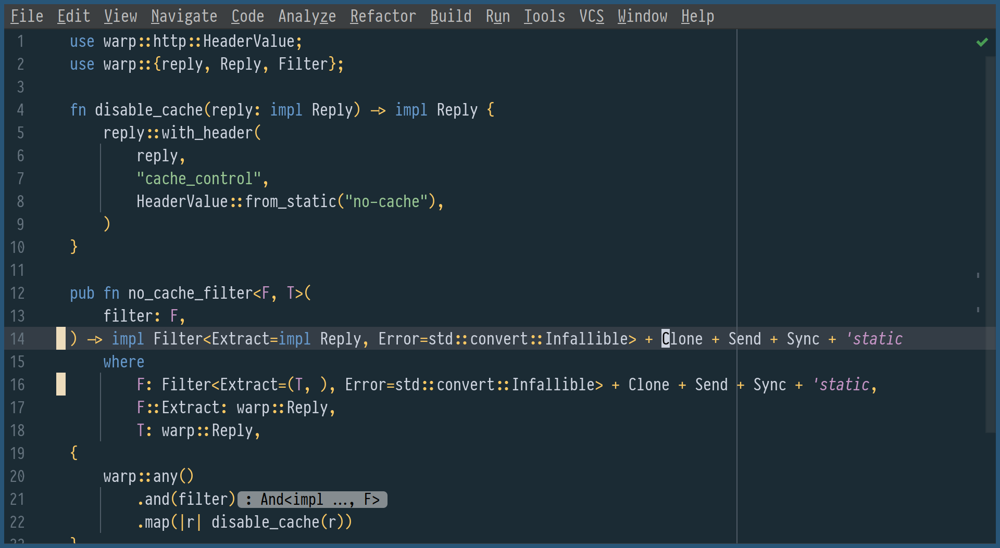
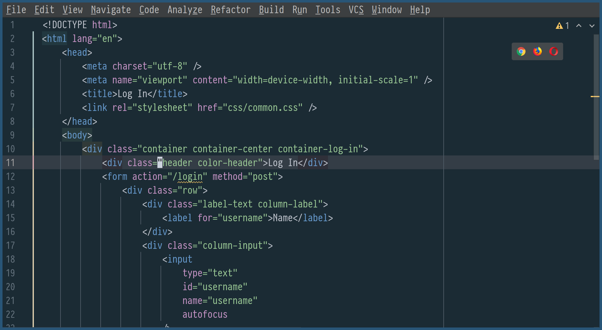

# Oceanic Primal color scheme for IntelliJ IDEA

<!-- Plugin description -->

**Oceanic Primal** color scheme for [IntelliJ IDEA](https://www.jetbrains.com/idea/)

<!-- Plugin description end -->

**Not** [base16](http://chriskempson.com/projects/base16/) theme: fewer color, more ocean

A minimalistic theme based on [Oceanic Primal palette](https://github.com/oceanic-primal/palette), inspired by [Oceanic-Next.vim](https://github.com/mhartington/oceanic-next)

[JetBrains Plugins Repository link](https://plugins.jetbrains.com/plugin/15141-oceanic-primal-theme)

Font on screenshots is [PragmataPro](https://fsd.it/shop/fonts/pragmatapro/)

-   [Oceanic Primal for VIM](https://github.com/barlog-m/oceanic-primal-vim)
-   [Oceanic Primal for Sublime Text](https://github.com/barlog-m/oceanic-primal-sublime)
-   [Oceanic Primal for other programs](https://github.com/barlog-m/oceanic-primal)
